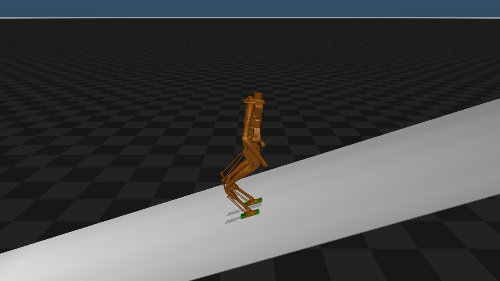
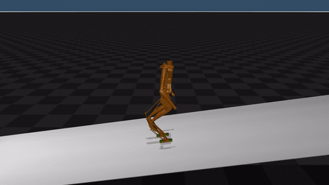
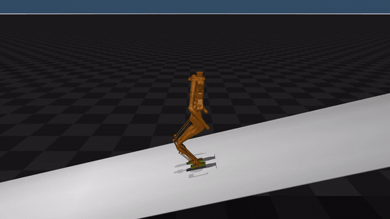
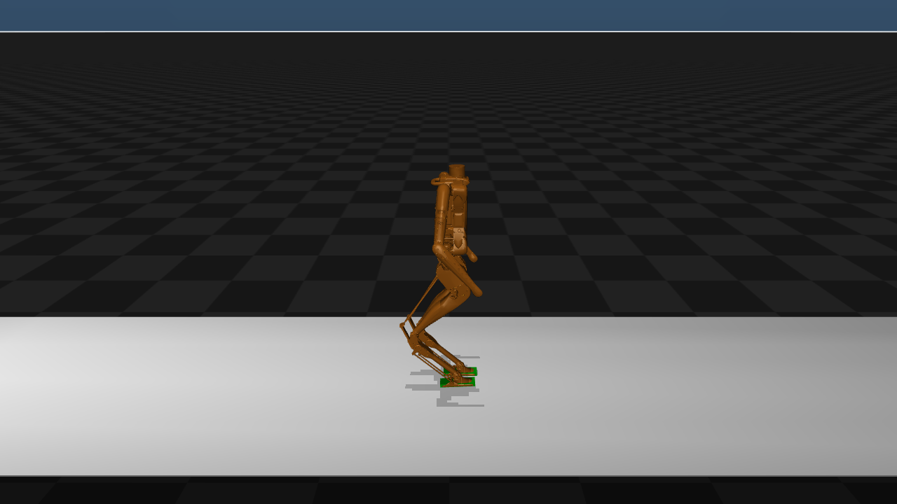
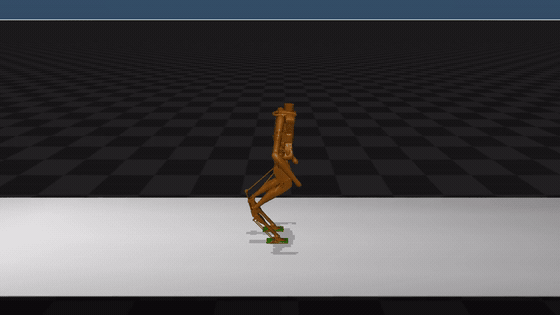

# Biased H-LIP Control for Walking on Sloped and Accelerating Ground

**Nhan Le, I-Chia Chang, and Yan Gu**  
School of Mechanical Engineering, Purdue University

---

Humanoid walking on sloped terrain and accelerating ground shifts the natural center of mass (CoM) balance point through gravito-inertial effects. This repository accompanies our work on a **Biased H-LIP** stepping controller that embeds those effects as a **shifted equilibrium** in the reduced-order dynamics, preserving the standard H-LIP structure and enabling unified step planning with minimal modification.

Evaluated in **MuJoCo** on a **36-DOF Digit** humanoid on a controllable moving platform, against standard H-LIP and adaptive ankle torque control.

## Key findings

- Biased H-LIP achieved the most **consistent performance** across disturbance-rejection (DRS) test cases.
- Strongest gains under **larger or sustained** platform acceleration and slope disturbances.
- Adaptive ankle torque can outperform on **small, continuously changing** disturbances, which is expected because Biased H-LIP corrects through foot placement and may need one or more steps to recover.
- **Takeaway:** Biased H-LIP improves overall robustness and gives a model-based interpretation of how slope and acceleration shift CoM behavior—useful for future robust control and learning-based stabilization.

## Simulation previews

GIF previews load inline on GitHub. Full MP4 recordings are linked under each clip.

### 15° inclined platform



### Constant platform velocity (DRS)



[Full recording (MP4)](recordings/constant_drs.mp4)

### Sinusoidal platform motion (DRS)



[Full recording (MP4)](recordings/sinusoidal_drs.mp4)

### Constant platform acceleration (+1 m/s²)

Bus-level sagittal acceleration; comparable to the poster example.



### Constant platform deceleration (negative acceleration)



[Full recording (MP4)](recordings/constant_negative_acceleration_drs.mp4)

## Method (brief)

Effective gravito-inertial acceleration is written as `g_eff = (g_eff,x, g_eff,z)`, where `g_eff,x` is the sagittal bias and `g_eff,z` is the normal component. The biased CoM dynamics are

```
x_ddot = alpha^2 * (x - x_eq)
alpha  = sqrt(g_eff,z / z0)
x_eq   = z0 * g_eff,x / g_eff,z
```

In shifted coordinates the nominal H-LIP step planner carries over. Desired pre-impact states follow the fixed point in original `x`, and the deadbeat step update is

```
u_k = u* + K @ ([x - x*, v - v*])
```

For onboard use, `g_eff` is estimated from torso IMU acceleration and stance-foot kinematics.

Implementation of the sagittal deadbeat controller: [`biased_hlip.py`](biased_hlip.py).

## What is in this repository

| Content | Description |
| --- | --- |
| [`biased_hlip.py`](biased_hlip.py) | Sagittal Biased H-LIP deadbeat stepping controller |
| [`data/`](data/) | Representative simulation logs (`.dat`, NumPy `float32` memmap) |
| [`plot_data.py`](plot_data.py) | Diagnostic plotting from logged data |
| [`recordings/`](recordings/) | Visual examples (GIF previews, PNG snapshots, full MP4) |

Logged signals include reduced-order model states, Biased H-LIP states and gains, platform motion and IMU data, joint states, task-space outputs, ground reaction forces, torques, and adaptive / effective-gravity diagnostics.

The full MuJoCo simulation and low-level whole-body controller are **not** included here.

## Quick start (plots)

```bash
pip install numpy matplotlib
python plot_data.py
```

By default, `plot_data.py` shows velocity tracking error from nominal. Enable other diagnostics near the bottom of the file.

## Simulation setup (from poster)

- **Robot:** 36-DOF Digit in MuJoCo on a controllable platform.
- **Benchmarks:** standard H-LIP, adaptive ankle torque control, proposed Biased H-LIP.
- **Disturbances:** step changes use **2.5 s transition ramps** to avoid physically unrealistic discontinuities.

## References

1. X. Xiong and A. D. Ames, “3-D underactuated bipedal walking via H-LIP based gait synthesis and stepping stabilization,” *IEEE Trans. Robot.*, vol. 38, no. 4, 2022.
2. Z. Li, C. Zhou, N. G. Tsagarakis, and D. G. Caldwell, “Compliance control for stabilizing the humanoid on the changing slope based on terrain inclination estimation,” *Auton. Robots*, vol. 40, no. 6, 2016.
3. J. Stewart, I.-C. Chang, Y. Gu, and P. A. Ioannou, “Adaptive ankle torque control for bipedal humanoid walking on surfaces with unknown horizontal and vertical motion,” arXiv:2410.11799, 2024.
